# WindowsHelloForBusiness_Deployment
Configuración del tenant de M365 para usar Windows Hello For Business

## Requisitos

Se necesita.

* Un tenant de M365 con licencia de Intune (Para Windows Hello For Business Avanzado)
* Una VM de Windows 11 con un usuario local.

## ¿Qué es Windows Hello para la Empresa?

`Windows Hello for Business` es una solución de autenticación de Microsoft diseñada para reemplazar las contraseñas tradicionales con métodos de inicio de sesión más seguros y convenientes. Utiliza tecnologías de autenticación biométrica (como reconocimiento facial o huellas dactilares) y claves de seguridad basadas en PIN, eliminando la dependencia de contraseñas que son vulnerables a ataques de phishing y robos. Windows Hello for Business integra autenticación de dos factores y cifrado de hardware, ofreciendo una forma robusta y fácil de usar para proteger el acceso a dispositivos, redes y aplicaciones empresariales.

Windows Hello for Business, en adelante `WHFB` se puede (y se debe) usar para proteger convenientemente la MFA al acceder a las aplicaciones de M365. En este artículo nos centraremos en el uso de esta tecnología para iniciar sesión en los dispositivos clientes de Windows. 

Recuerda que `WHFB` no usa contraseñas, es decir, es `PasswordLess`. De esta forma, al no usar contraseñas para autenticar a los usuarios en sus dispositivos, se eliminan de forma radical todas las amenazas basadas en capturas de la contraseña, robos de hash, etc.

`Windows Hello` es una característica que aparece en `Windows 10`, pero no debe confundirse con `WHFB`, que es la versión de empresa y ofrece muchas más posibilidades. Teniendo esto en cuenta, a partir de ahora, cuando hagamos referencia a `Windows Hello`, nos referimos a su versión empresarial (`WHFB`).

Con `WHFB`, en lugar de iniciar sesión en el dispositivo con un `Nombre de usuario` y una `Contraseña`, podemos iniciar sesión...

* Con un `PIN`
* Usando `Biometría` (huella digital o reconocimiento facial)
* Con un `Hardware Security Token` como los que proporciona `FIDO2`.

Con `WHFB` la organización se mueve a una nueva dirección, consistente en ***NO UTILIZAR NUNCA MÁS CONTRASEÑAS*** en las autenticaciones. Esta estrategia se conoce como `PasswordLess`.

`WHFB` es entonces una forma mucho más segura de iniciar sesión en los dispositivos, ya que, al usar un PIN, biometríca o tokens de hardware, estos no abandonan (se transmiten) el dispositivo en ningún momento. En consecuencia no pueden ser capturados por la red.

## Primera opción de configuración de WHFB

La primera forma de configurar `WHFB` es 'no hacer nada', ya que `WHFB` está habilitado por defecto en todos los tenants de M365. Por consiguiente, podemos usarlo directamente.

Nos logamos en el tenant y creamos un usuario de prueba. 
Nota: La contraseña es `Pa55w.rd12345`.

Asignamos licencias.

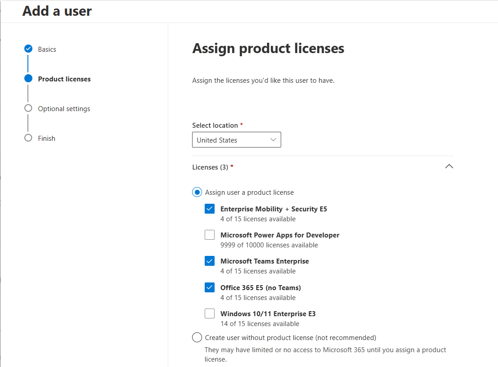

El dispositivo del usuario debe estar registrado en `Microsoft Entra ID`. Tienes dos formas de conseguirlo:

* Uniendo el disposito al dominio de `Entra ID`.
* Registrando el dispositivo en `Entra ID`.

El `registro` al dominio es útil cuando queremos que `Microsoft Entra ID` identifique al dispositivo, que puede ser `Linux`, `Android`, `IoS`, `MAC` y por supuesto `Windows`. Para `WHFB`, como es lógico solo se puede aplicar a sistemas operativos de Windows.

La `Unión al Dominio de Microsoft Entra ID` es la forma más cómoda cuando la organización es nativa de nube.

Existe la posibilidad de la `Unión híbrida al dominio de Microsoft Entra ID`, donde el dispositivo puede ser a la vez miembro del dominio de la nube y del on-prem (`ADDS`)

Por simplicidad de la práctica, vamos a usar la `unión al dominio en la nube`, pero ten en cuenta que `WHFB` funciona para cualquier escenario.

Más adelante vamos a ver formas avanzadas de `WHFB`, que requerirán el uso de `Intune` (Endpoint Manager). Por esa razón, ahora es buen momento para activar la configuración que permite que un dispositivo inscrito sea gobernado automáticamente por `Intune` (inscripción automática en Intune).
Nota: Un dispositivo `inscrito` en `Entra ID` es aquel que o bien ha sido `registrado` o ha sido `unido al dominio de Entra ID`.

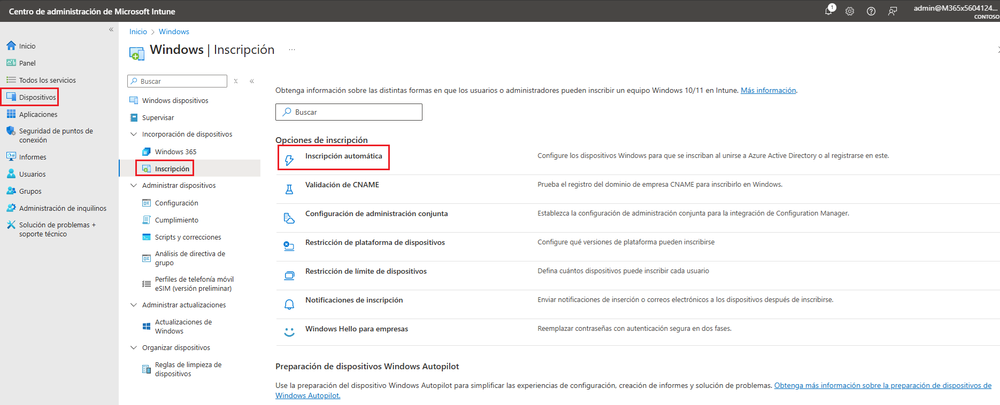

Seleccionamos ***Todo*** en ámbito MDM y Guardamos. Esto permitirá que todos los usuarios puedan inscribir sus dispositivos en Intune.

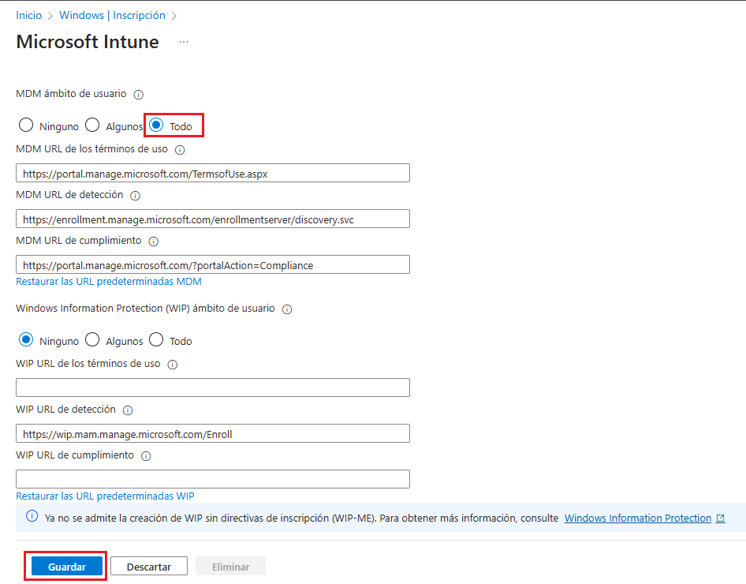

De vuelta a la página de inscripción, seleccionamos la configuración de `WHFB`.

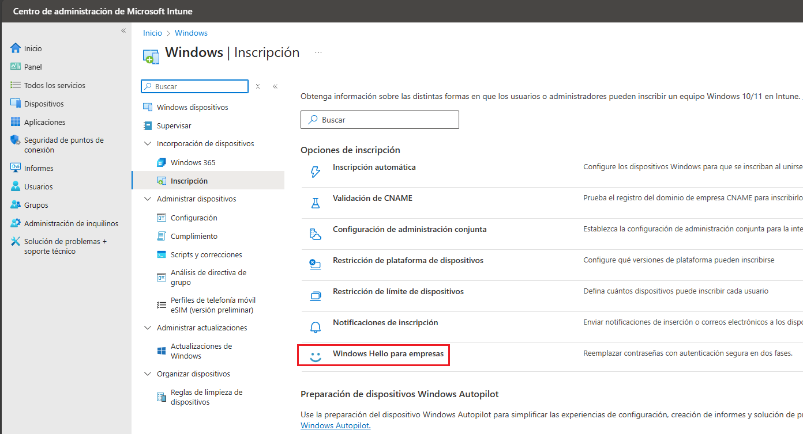

Estudia la siguiente imagen.

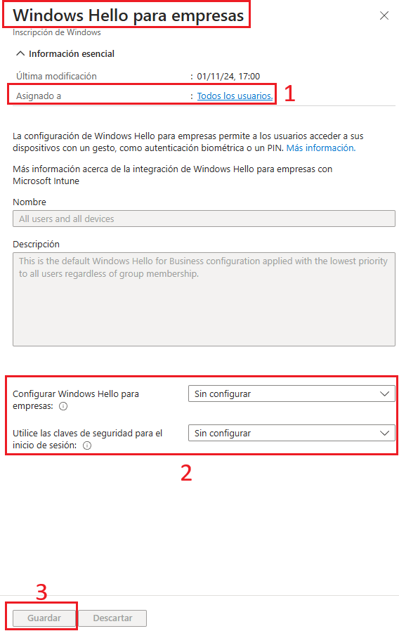

En (1) puedes comprobar que `WHFB` está habilitado para ***Todos los usuarios***. En su configuración por defecto, como ya anunciamos, no hay que hacer nada. Las opciones que puedes ver en (2) las trataremos más adelante. Por esta razón, el botón ***Guardar*** (3) no se activa.

Vamos a proceder a unir el dispositivo al dominio de la nube. Para ello vamos a `Settings`, `Accounts` y hacemos clic en `Access work or school`.

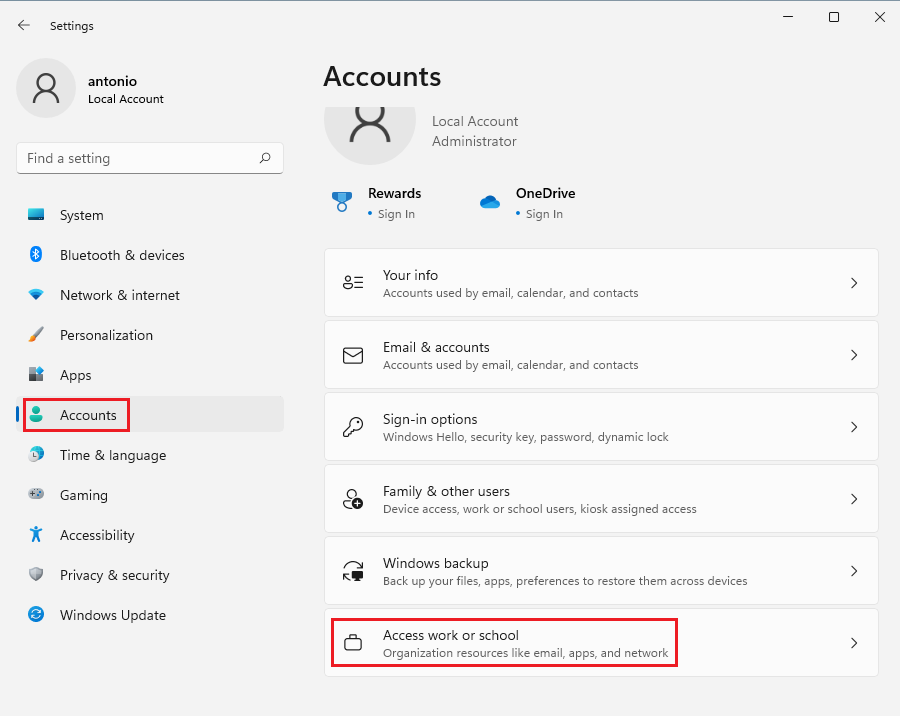

Hacemos clic en `Connect`.

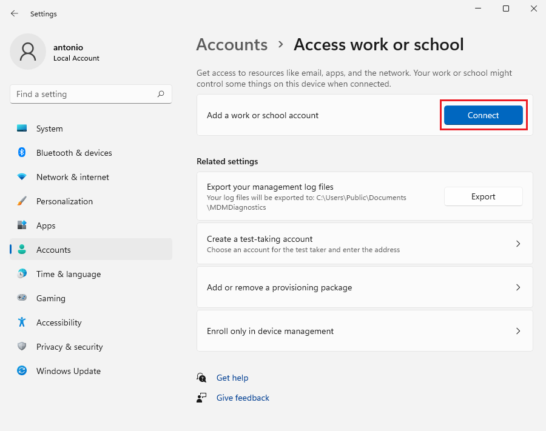

Observa la siguiente imagen.

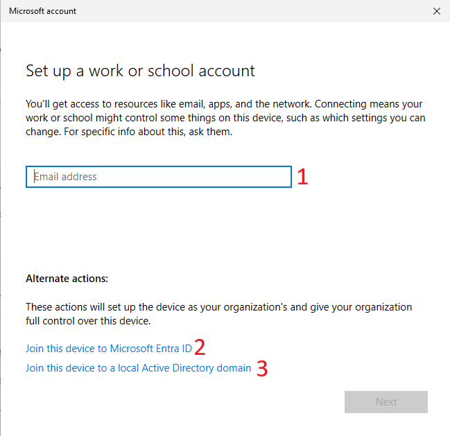

Si pones el email del usuario en (1) se procederá al `registro`. En (2) podemos unir al dispositivo al dominio de `Entra ID`. Por último, en (3), unimos al dispositivo al dominio on-prem `ADDS`. Elegimos la opción (2).

Nos autenticamos con el usuario.

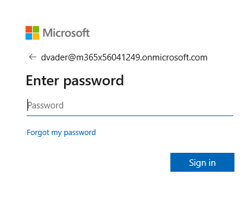

Un mensaje nos indica que comprobemos si todo es correcto.

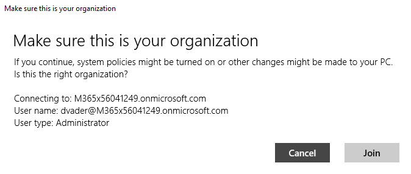

hacemos clic en `Join`.

Se está procediendo a inscribir el dispositivo en `Entra ID`.

Volvemos a la página de administración de `Intune` y, tras un par de minutos, como muestra la imagen, podrás ver el equipo. Recuerda que Intune solo se necesita para poder configurar los ajustes avanzados de `WHFB` y, en muchos escenarios, no es necesario realizarlos, ya que la protección por defecto de `WHFB` cumple las necesidades de la mayoría de nosotros.

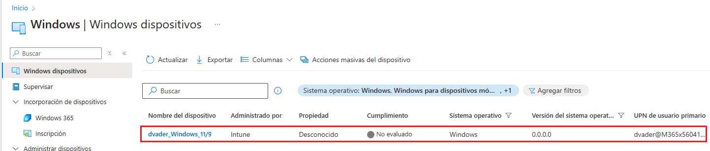

Ahora debemos configurar `Windows Hello` en el dispositivo. Para ello cerramos sesión. 

Elegimos `Otro usuario` y escribimos el email del usuario de ejemplo y su contraseña.

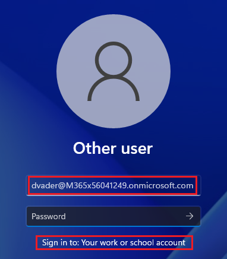

La contraseña sigue siendo necesaria para configurar Windows Hello en el dispositivo, pero a partir de entonces no se usará.

Se crea el perfil del usuario.

Como puedes ver en la siguiente imagen, se nos invita a configurar `Windows Hello`.

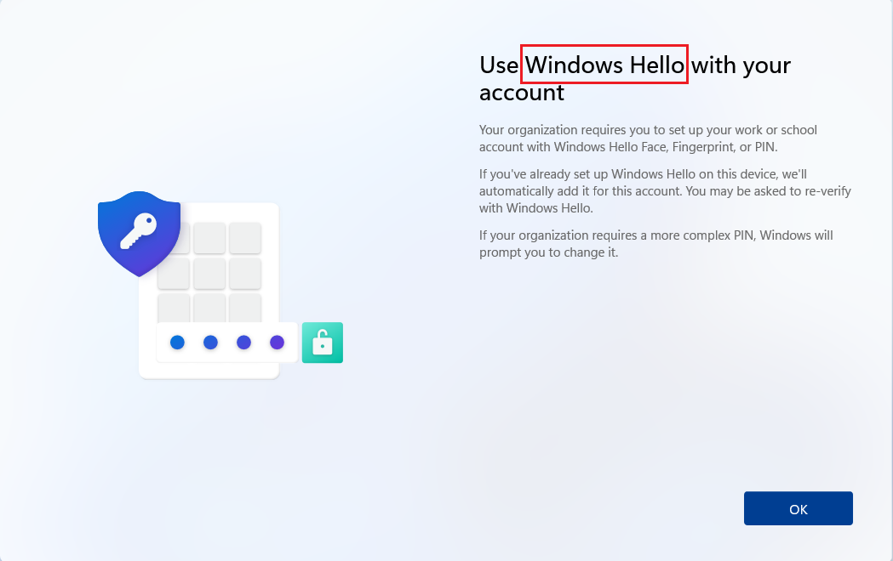

Un mensaje nos indica que debemos activar la `MFA` para el usuario.

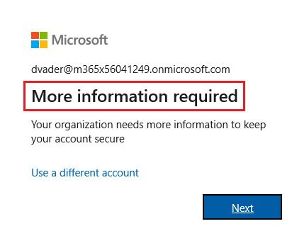

`WHFB` exigirá un 2FA cuando se vaya a reconfigurar, por ejemplo, por olvido del `PIN`. Así que tenemos que configurar la 2FA. 

Seguimos los pasos indicados: Instalar `Microsoft Authenticator` y lo configuramos.

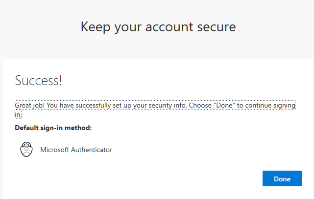

Es el momento de configurar nuestro `PIN`.

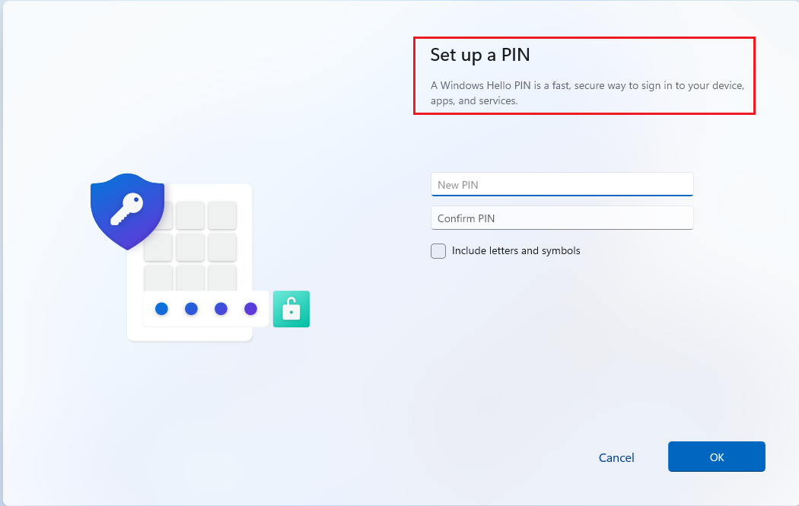

Un mensaje nos indica que hemos finalizado la configuración de `Windows Hello` en el dispositivo.

Cerramos la sesión y comprobamos que ya podemos iniciarla con PIN (y sin contraseña)

Observa que, tenemos otras opciones disponible para iniciar sesión.

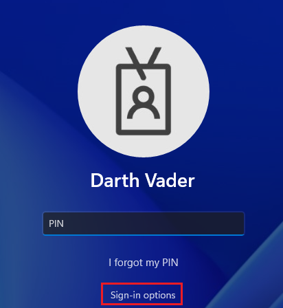

Si te fijas, tenemos la contraseña.

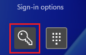

Esto tiene sentido porque lo que hemos hecho es añadir una nueva forma de inicio de sesión, basada en PIN, pero no se ha anulado el uso de las contraseñas.

Observa la siguiente imagen.

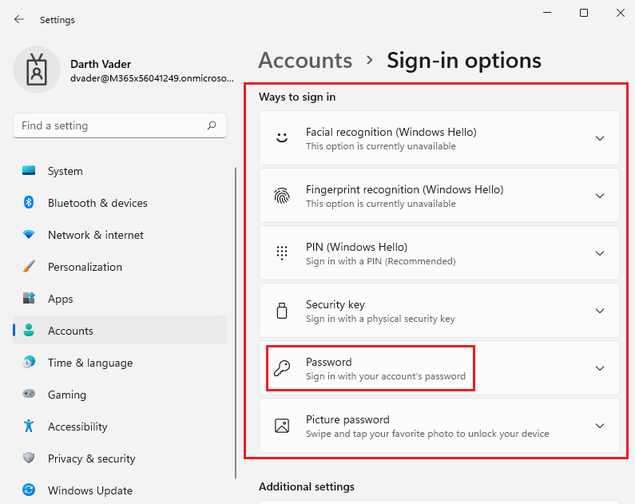

Puedes ver las diferentes formas en las que se permite el inicio de sesión. 

Para `Windows Hello` se tiene:

* ***Reconocimiento facial*** (hace falta una cámara especial. Consulta los requisitos)

* ***Huella digital***. Si el dispositivo tiene lector de huella digital, el asistente de configuración de `Windows Hello` te guía para grabar la información biométrica.

* ***PIN***. Esta es la opción que hemos configurado en este tutorial, ya que la VM no tiene ni webcam ni hardware biométrico.

Otras formas de inicio de sesión:

* ***Security key***. Son tokens que almacenan dispositivos de hardware (FIDO2).

* ***Password***. Es la tradicional.

* ***Picture password***. Permite dibujar un patrón con el ratón (o con el dedo en dispositivos táctiles)

Un poco más abajo verás lo siguiente.

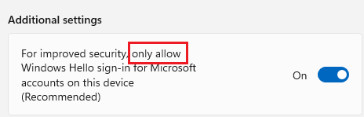

Solo se permiten los inicios de sesión que ofrece `Windows Hello`.

Como imaginarás, lo que vamos a tratar a continuación, determinará qué opciones de inicio de sesión se le ofrece al dispositivo del usuario. Esta configuración se realizará en `Microsoft Entra ID` y una vez configuradas, el usuario no podrá cambiarlas en su dispositivo.

## Segunda opción de configuración de WHFB

La forma de configurar `WHFB` que hemos explicado no es realmente una opción, ya que `WHFB` estaba ya configurado en el tenant. Solo hemos indicado (mediante la inscripción de dispositivo) que `Windows 11` use `Windows Hello` para iniciar sesión. 

En esta segunda opción, vamos a aprender a cambiar algunos de los ajustes de seguridad de `WHFB`.

De vuelta al Centro de administración de Intune (Endpoint Manager), seleccionamos `Windows Hello for Business`.

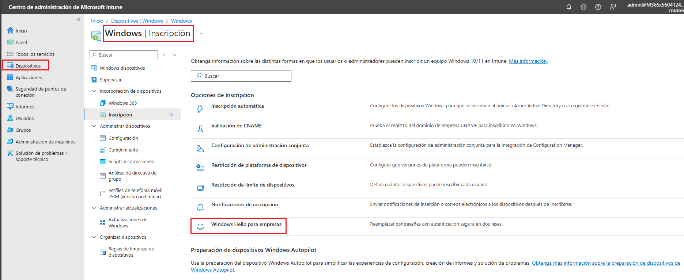

Observa la siguiente imagen.

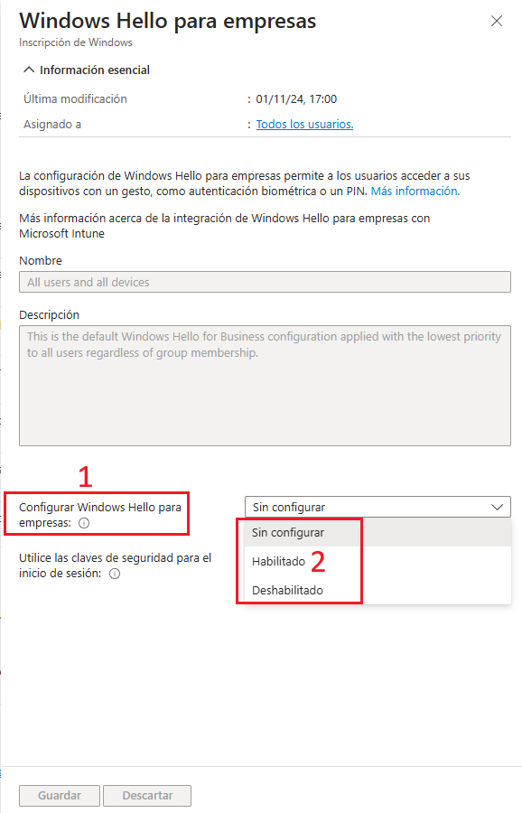

`WHFB` ya está habilitado. No confundas lo que vamos a hacer, que consiste en habilitar la ***Configuración*** del servicio (1), no el propio servicio, que ya está habilitado. Para ello, selecciona ***Habilitado*** (2). Aparecerán multitud de opciones.

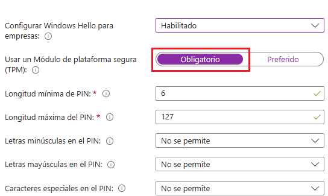

La exigencia del módulo `TPM` es un factor clave. Si el hardware del  dispositivo no lo tiene, `WHFB` no se podrá configurar. La opción `Preferido` hace que dicho TPM se emule en los dispositivos de Windows 10 que no lo tengan. (Recuerda que la presencia del TPM es obligatoria para poder instalar Windows 11).

Si usamos la barra de desplazamiento vertical, accedemos a más opciones. Recomendamos leer detenidamente las ayudas mostradas por los toltips.

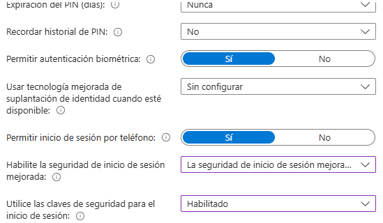

Comprueba que los ajustes quedan como en la imagen.

¿Qué implica el ajuste `Habilite la seguridad de inicio de sesión mejorada`?

Este ajuste mejora el proceso de inicio de sesión al proporcionar protecciones adicionales para la validación de la identidad del usuario. Esto incluye:

* ***Autenticación más segura***: Refuerza la resistencia contra ataques como la suplantación de identidad o el uso de credenciales robadas.

* ***Uso de TPM***: Asegura que la clave de autenticación esté almacenada en un Módulo de Plataforma Segura (TPM, por sus siglas en inglés), lo que proporciona protección de hardware contra manipulaciones.

* ***Protección ante amenazas***: Reduce el riesgo de ataques basados en técnicas de interceptación o de fuerza bruta al utilizar métodos avanzados de verificación y cifrado.

¿Y el ajuste `Utilice las claves de seguridad para el inicio de sesión`?

Pues se refiere a la habilitación de un método de autenticación que utiliza claves de seguridad físicas (como llaves USB compatibles con `FIDO2`) para iniciar sesión en dispositivos y servicios.

Las Llaves de seguridad son dispositivos físicos que actúan como un segundo factor de autenticación o, en algunos casos, como el principal método de inicio de sesión. Estas claves generalmente usan protocolos de seguridad como FIDO2 (Fast Identity Online 2) para proporcionar un acceso seguro y sin contraseña a dispositivos y aplicaciones.

¿Cómo funcionan?
* ***Llaves USB, NFC o Bluetooth***: Los usuarios insertan la llave de seguridad en un puerto USB o la conectan a través de NFC/Bluetooth para autenticarse.

* ***Cifrado asimétrico***: Las llaves de seguridad funcionan mediante un sistema de cifrado asimétrico, donde una clave pública y una clave privada se utilizan para validar al usuario. La clave privada nunca sale del dispositivo físico, lo que la hace más segura que las contraseñas tradicionales.

* ***Interacción del usuario***: En la mayoría de los casos, el usuario debe interactuar físicamente con la llave (por ejemplo, presionando un botón) para confirmar su identidad, lo que añade un nivel de protección contra el acceso remoto no autorizado.

Hacemos clic en ***Guardar*** para actualizar la configuración de `WHFB` en el tenant.

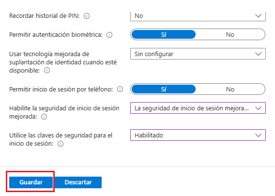

## Tercera opción de configuración de WHFB

Acabamos de ver cómo se modifica la configuración de seguridad de `WHFB` a nivel de tenant. pero ¿qué ourriría si requieres ajustes más detallados? Por ejemplo, que los ejecutivos de la empresa tengan un PIN más complejo.

Para ello es necesario usar políticas de configuracion de Intune (y sus respectivas licencias)

Lo primero que debemos hacer es desactivar la configuración general de `WHFB` en el tenant, pues será Intune quien configure `WHFB`. Asegúrate que la configuración queda así y haz clic en ***Guardar***.

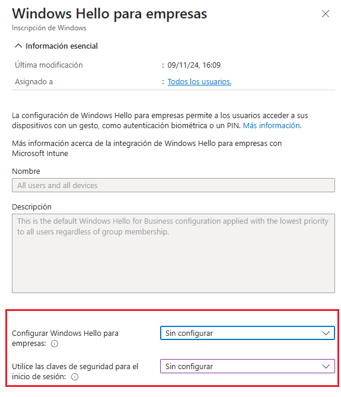

A los efectos de este tutorial, vamos a crear un grupo de seguridad en Azure que contendrá los equipos a los que deseemos configurar `WHFB`.

En el Centro de Administración de Microsoft Entra, crea un grupo.

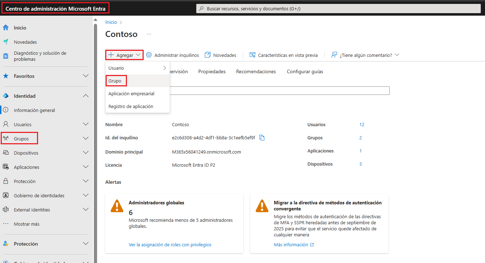

Creamos el grupo con la siguiente configuración.

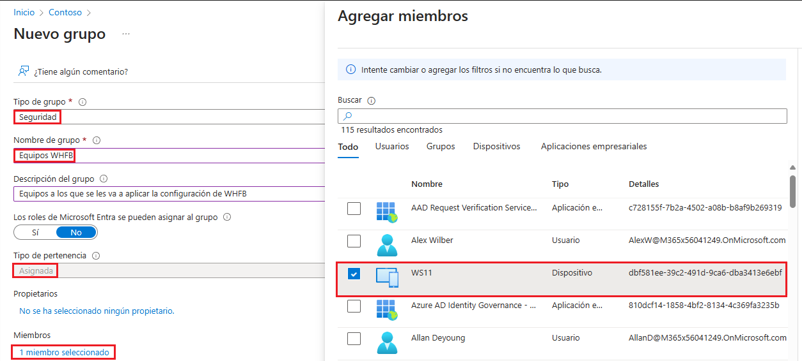

Vamos a crear una serie de políticas en Intune para aplicar `WHFB`.Seleccionamos ***Configuración***.

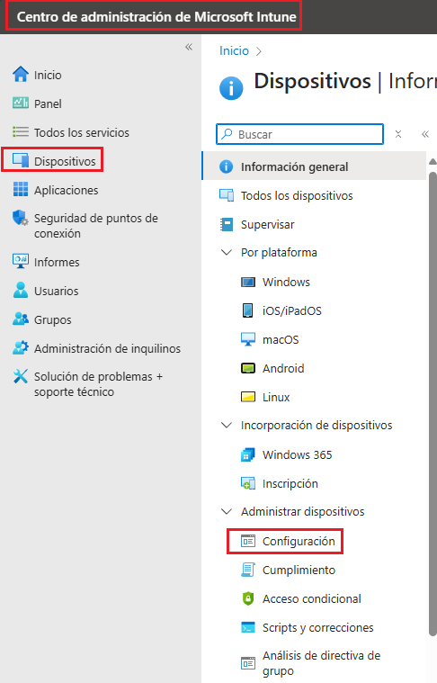

Creamos una nueva directiva. En `Plataforma` elegimos `Windows 11 y posteriores`. En `Tipo de perfil` seleccionamos `Catálogo de configuración` y hacemos clic en ***Crear***

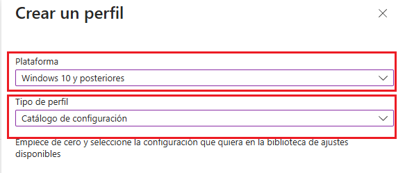

En `Datos básicos` ponemos un nombre a la directiva y hacemos clic en ***Siguiente***.

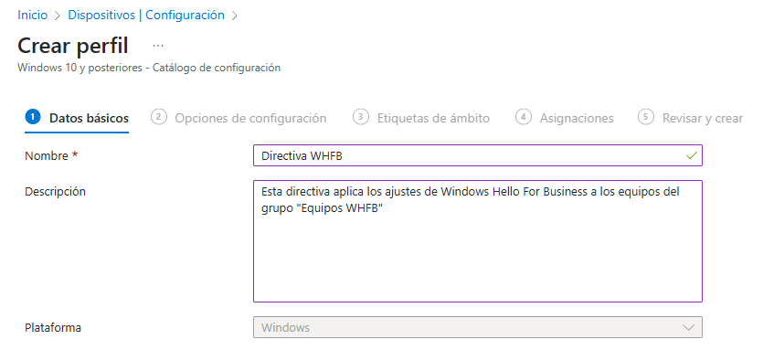

En el siguiente paso, hacemos clic en `Agregar configuración` (1) , luego elegimos `Windows Hello para la Empresa` (2). En (3) puedes observar cómo aparecen todas las configuraciones disponibles para `WHFB`.

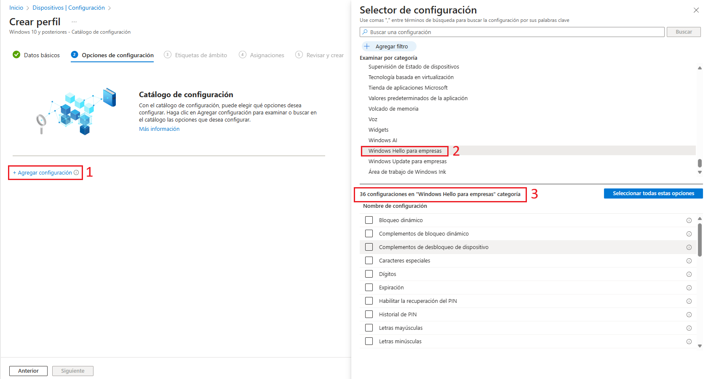

Marcamos las siguientes (Realmente las que necesites):

* Caracteres especiales.
* Dígitos.
* Expiración.
* Habilitar la recuperación del PIN.
* Historial de PIN.
* Letras mayúsculas.
* Letras minúsculas.
* Longitud máxima del PIN.
* Longitud mínima del PIN.
* Requerir dispositivo de seguridad.
* Usar Windows Hello para empresas (dispositivo)
* Grupo A.
* Grupo B.
* Habilitar ESS con periféricos compatibles.
* Permitir el uso de biometría.
* Usar clave de seguridad para el inicio de sesión.
* Uso de protección mejorada contra la suplantación de identidad en características faciales.

Conforme las vayas seleccionado, irán aparenciendo en la interfaz gráfica para que las configures. Recomendamos leer la ayuda de los toltips.

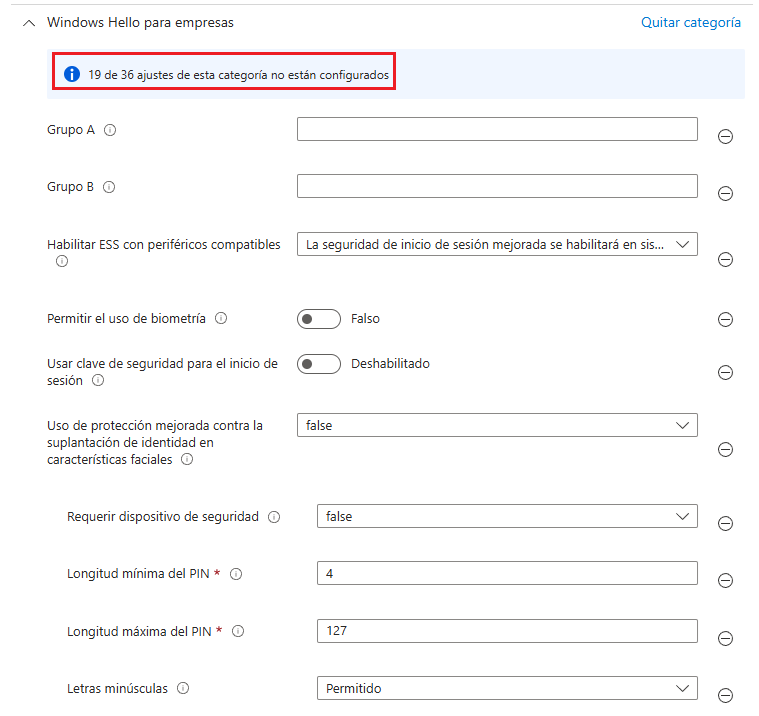

De todos los ajustes, `Grupo A` y `Grupo B` merecen una explicación aparte, pero no será en este momento. Haz clic en el bótón `Sin Configurar`(-) para no aportar en este momento la configuración.

Debe quedar así.

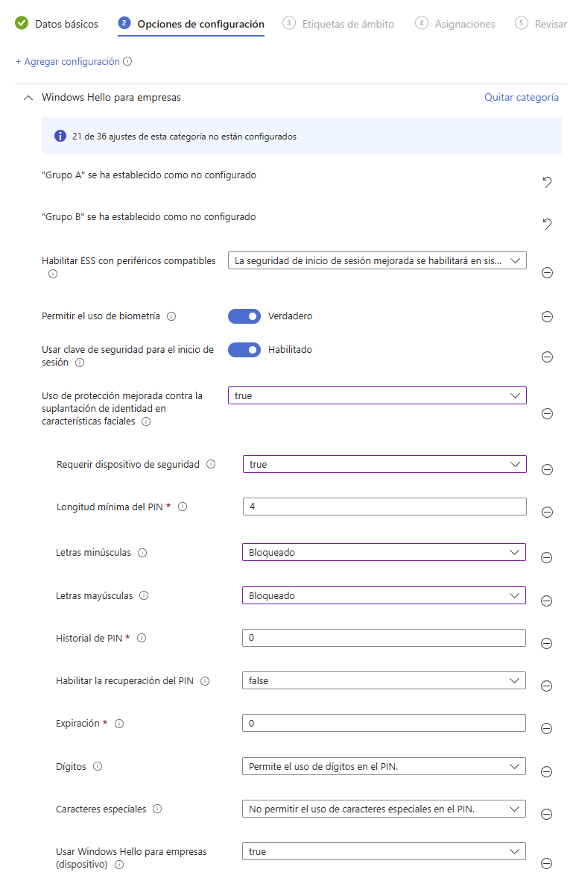

Haz clic en ***Siguiente***.

Avanza hasta `Asignaciones`.

Selecciona el grupo de equipos a los que se aplicará esta directiva.

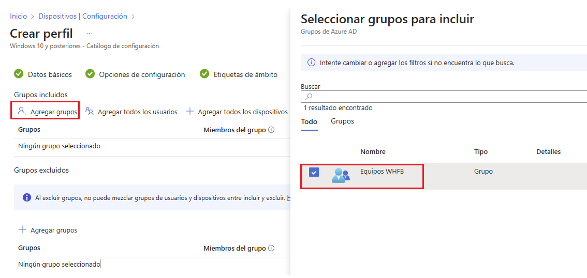

Avanza hasta el final y crea la directiva.

Comprueba que se ha creado correctamente.

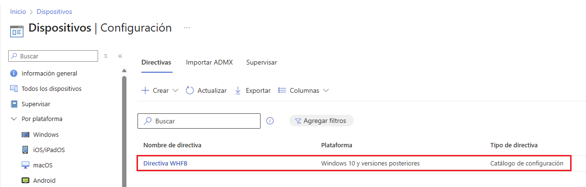

## Actividades que puede realizar el usuario en Windows Hello.

En el equipo de Windows 11, ya tenemos configurado el uso del `PIN` en `Windows Hello`.

En la imagen puedes ver las `formas de iniciar sesión` o métodos disponibles. Observa como ni el `reconocimiento facial` ni el `reconocimiento de huella digital` están disponibles. Esto se debe a que la máquina virtual que estamos usando no dispone del hardware virtual apropiado. En un dispositivo real, si el hardware está presente, también lo estarán las opciones asociadas.

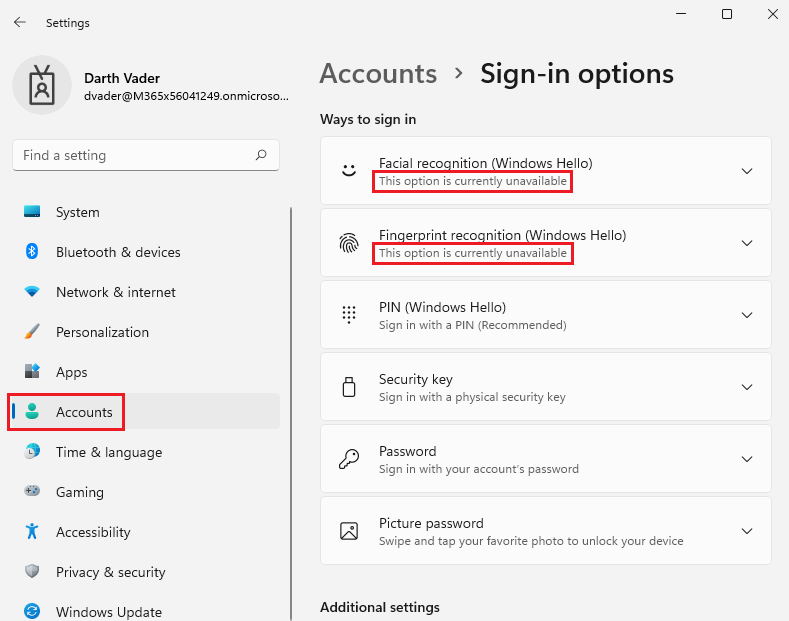

En el caso del `PIN`, el usuario puede cambiarlo en cualquier momento (1). Como la `Directiva de Intune` establece la configuración de `WHFB`, el usuario no puede quitar este método de inicio de sesión (2). En el caso de olvidar el `PIN`, podemos poner otro haciendo clic en (3) 

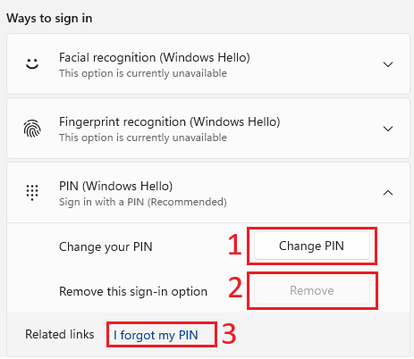

Se muestra el siguiente mensaje.

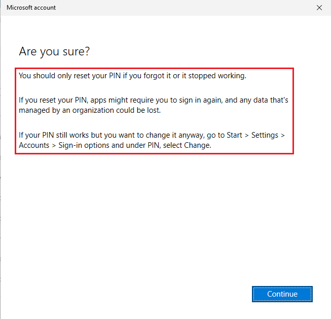

Debemos tener cuidado, porque no es lo mismo resetear el `PIN`, que cambiarlo por otro (que requiere el conocimiento del actual). Si reseteamos el `PIN`, todos los secretos criptográficos asociados a este ya no serán accesibles, y por eso se muestra el mensaje anterior. Si lo que realmente deseamos es ***Cambiar el PIN***, entonces debemos hacerlo mediante la opción de cambio.

La opción de `Reconocimiento facial`, exige disponer de hardware compatible. En [este enlace](https://learn.microsoft.com/en-us/windows/security/identity-protection/hello-for-business/#facial-recognition-sensors) podemos leer sobre ello. En [este otro enlace](https://www.pcworld.com/article/394379/windows-hello-webcams-you-can-buy-right-now.html) se muestran algunos dispositivos compatibles.

La configuración del reconocimiento facial se realiza haciendo clic en el botón `Set up`.

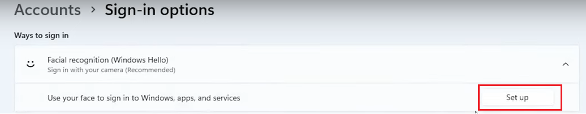

A continuación seguimos las indicaciones del asistente.

Una vez finalizado el proceso de reconocimiento, podemos volver a iniciarlo por medio del botón ***Improve recognition***(1), en el caso de que no se reconozca nuestro rostro correctamente. Observa también la opción ***Automatically dismiss the lock screen if Windows recognises tour face***(2).

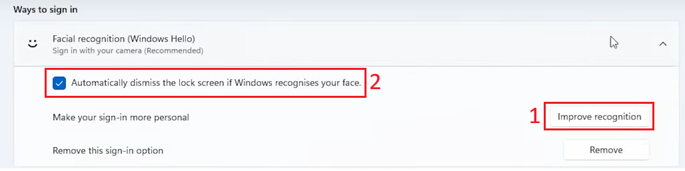

Esta última configuración es muy recomendable, ya que desbloquea la pantalla simplemente poniendote delante del dispositivo. En la siguiente imagen puedes ver cómo Windows está intentando reconocer el rostro y en caso afirmativo, desbloquearía la pantalla o iniciaría sesión.

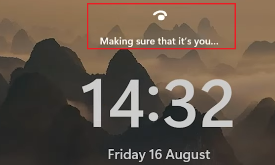

Hasta el momento hemos usuado `Intune` para configurar `WHFB`, pero no hemos encontrado diferencias significativas respecto a lo que `WHFB` puede hacer sin tener que disponer de licencias de `Intune`. El verdadero poder que aporta `Intune` a la configuración de `WHFB` se llama `Multifactor unlock` y vamos a proceder a explicarla.

## Multifactor unlock.

Con `Multifactor unlock` debemos proporcionar ***DOS*** factores para inicar sesión o desbloquear el dispositivo. Recuerda que seguimos sin usar contraseñas (Passwordless), de forma que esta configuración de `WHFB` es la más robusta que puedes configurar y, virtualmente, reduces a cero el riesgo de suplantación de identidad.

Si usamos un `PIN` como factor de autenticación para Windows Hello, podemos pensar, y con razón, que no es suficientemente seguro si otra persona conoce dicho `PIN`. Es entonces donde activamos el segundo factor, a elegir entre los que ofrece Windows Hello. 

La siguiente demostración, configurará un `PIN` y `Reconocimiento facial`.

La documentación para desplegar `Multifactor unlock` puedes [encontrarla aquí](https://learn.microsoft.com/en-us/windows/security/identity-protection/hello-for-business/multifactor-unlock?tabs=intune)

Observa detenidamente la siguiente imagen (Está en la documentación anterior)

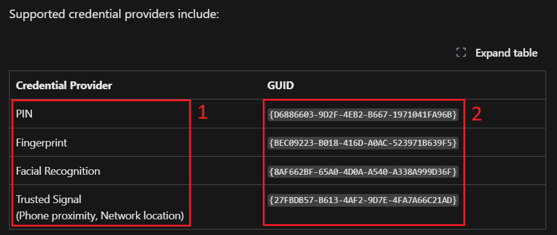

En (1) puedes ver los diferentes `Proveedores de credenciales`, mientras que en (2) ves el `GUID` o Identificador General Universal. Debes elegir cualquie combinación de estos dos factores, por ejemplo:

* `PIN` y `Facial Recognition`
* `Fingerprint` y `Facial Recognition`
* `Facial Recognition` y `Fingerprint`
* etc.

¿Recuerdas que en la configuración de la directiva de `WHFB` dejamos pendiente lo del `Group A` y el `Group B`? 

Vuelve a editar la directiva.

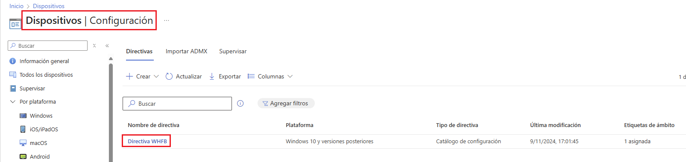

Desplázate hacia el final de la directiva y haz clic en `Editar` (Opciones de configuración)

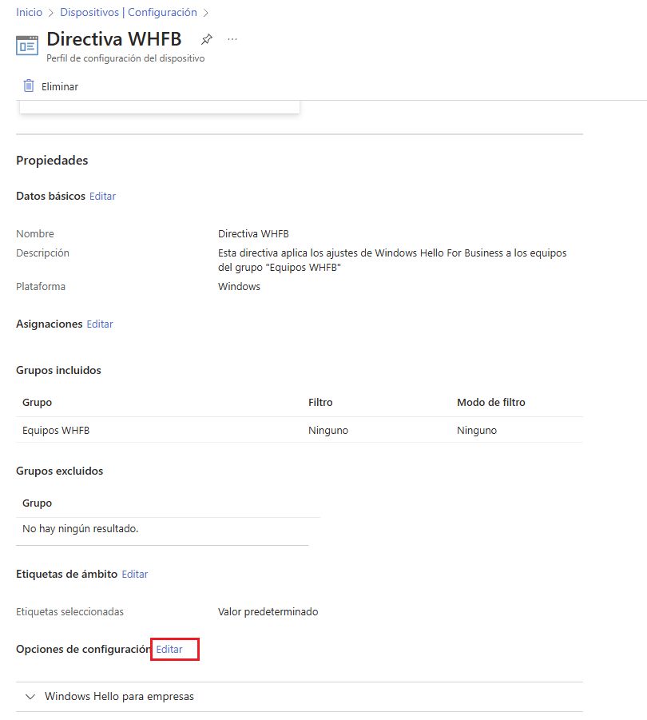

En `Editar perfil`, haz clic en `+Agregar configuración`.

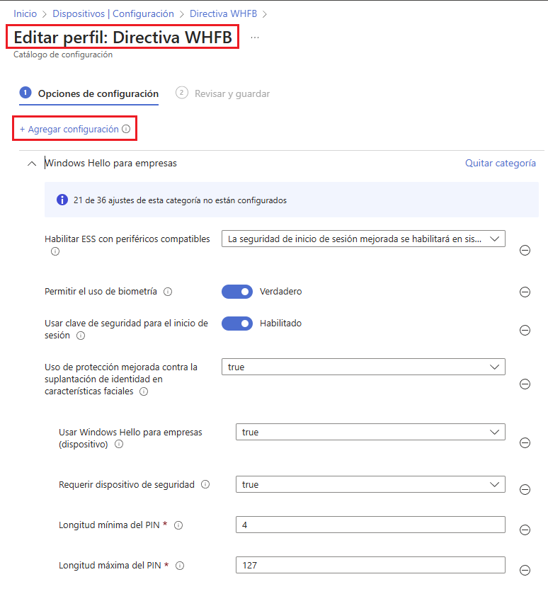

En (1) filtra por `hello`. A continuación selecciona `Windows Hello para empresas`(2) y por último, en (3) selecciona los checks para `Grupo A` y `Grupo B`.

[policy WHFB4](./img/202411101100.png) 

Con ello, ahora tenemos disponible las configuraciones de los dos grupos en la directiva.

[policy WHFB5](./img/202411101102.png) 

Solo queda acudir a la tabla de proveedores de credenciales y trasladar los respectivos `GUID` a los grupos. 

Supón que queremos como primer factor (Grupo A) el `Reconocimiento facial` y como segundo (Grupo B) el `PIN`. 

[policy WHFB6](./img/202411101108.png) 

Guarda la directiva. Cuando Intune la aplique, Windows deberá reconocer el rostro de la persona y, posteriormente solicitará el `PIN`. Esta doble factor se aplica para los inicios de sesión y para desbloquear la pantalla.

Con esto terminamos este tutorial. Recuerda que el uso de contraseñas es intrínsecamente INSEGURO y deberías desplegar en tu organización el uso de `Windows Hello para Empresas` para el inicio de sesión en Windows.

## Configurar WHFB en un entorno híbrido.

Como habrás visto, las nuevas tecnologías que ofrece `WHFB` bastionan de forma muy efectiva las autenticaciones contra `Microsoft Entra ID`. En organizaciones nativas en Azure, la solución se implementa de forma muy simple, como has visto en este tutorial, pero ¿qué aproximación debo tomar si tengo un directorio `ADDS` on-prem?

Microsoft también recomienda que uses `WHFB`, pero en este escenario deberás usar el `Modo híbrido de Windows Hello para la Empresa`.

Este modo permite que los dispositivos en un dominio de AD local usen `WHFB` para autenticarse en recursos tanto locales como en la nube. Como prerrequisito debes configurar `Microsoft Entra ID  Connect` (Azure AD Connect) para sincronizar tus objetos de AD DS con Azure AD, permitiendo la autenticación híbrida.

La documentación, junto con los pasos detallados para conseguir este despliegue, puedes [encontrarla aquí](https://learn.microsoft.com/es-es/windows/security/identity-protection/hello-for-business/deploy/hybrid-cloud-kerberos-trust?tabs=intune)

Recuerda que las tecnologías evolucionan, y los administradores debemos hacer lo propio. Hoy en día no es aceptable ser víctima de un incidente de seguridad relacionado con la identidad del usuario por seguir usando tecnologías de hace 20 años basadas en contraseñas. Sin duda, el cambio es un reto, pero en algún momento deberás hacer que tu organización sea `PasswordLess`.
