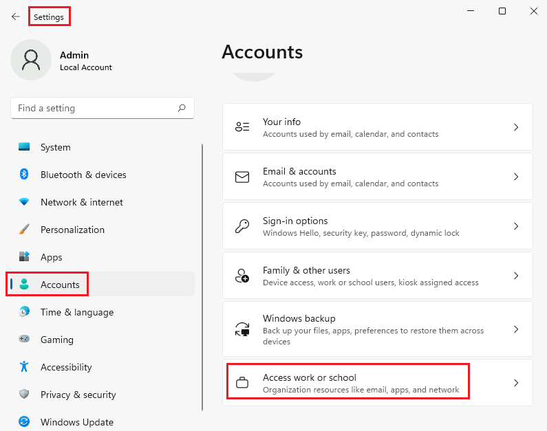
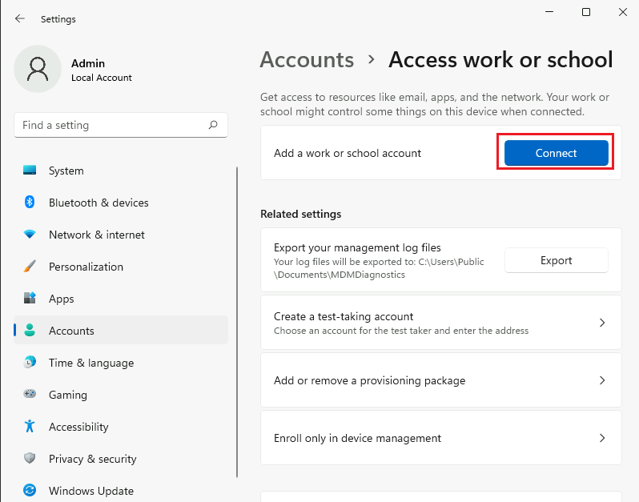
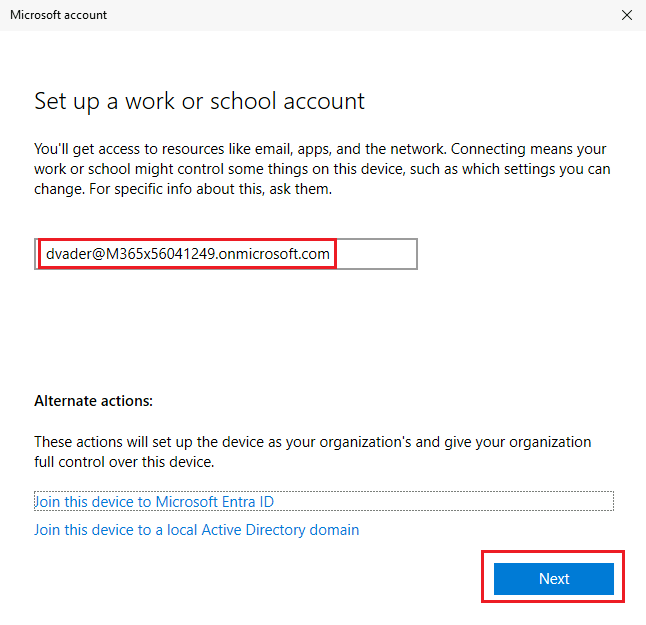
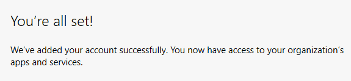

# WindowsHelloForBusiness_Deployment
Configuración del tenant de M365 para usar Windows Hello For Business

## ¿Qué es Windows Hello para la Empresa?

`Windows Hello for Business` es una solución de autenticación de Microsoft diseñada para reemplazar las contraseñas tradicionales con métodos de inicio de sesión más seguros y convenientes. Utiliza tecnologías de autenticación biométrica (como reconocimiento facial o huellas dactilares) y claves de seguridad basadas en PIN, eliminando la dependencia de contraseñas que son vulnerables a ataques de phishing y robos. Windows Hello for Business integra autenticación de dos factores y cifrado de hardware, ofreciendo una forma robusta y fácil de usar para proteger el acceso a dispositivos, redes y aplicaciones empresariales.

Windows Hello for Business, en adelante `WHFB` se puede (y se debe) usar para proteger convenientemente la MFA al acceder a las aplicaciones de M365. En este artículo nos centraremos en el uso de esta tecnología para iniciar sesión en los dispositivos clientes de Windows. 

Recuerda que `WHFB` no usa contraseñas, es decir, es `PasswordLess`. De esta forma, al no usar contraseñas para autenticar a los usuarios en sus dispositivos, se eliminan de forma radical todas las amenazas basadas en capturas de la contraseña, robos de hash, etc.

`Windows Hello` es una característica que aparece en `Windows 10`, pero no debe confundirse con `WHFB`, que es la versión de empresa y ofrece muchas más posibilidades. Teniendo esto en cuenta, a partir de ahora, cuando hagamos referencia a `Windows Hello`, nos referimos a su versión empresarial (`WHFB`).

Con `WHFB`, en lugar de iniciar sesión en el dispositivo con un `Nombre de usuario` y una `Contraseña`, podemos iniciar sesión...

* Con un `PIN`
* Usando `Biometría` (huella digital o reconocimiento facial)
* Con un `Hardware Security Token` como los que proporciona `FIDO2`.

Con `WHFB` la organización se mueve a una nueva dirección, consistente en ***NO UTILIZAR NUNCA MÁS CONTRASEÑAS*** en las autenticaciones. Esta estrategia se conoce como `PasswordLess`.

`WHFB` es entonces una forma mucho más segura de iniciar sesión en los dispositivos, ya que, al usar un PIN, biometríca o tokens de hardware, estos no abandonan (se transmiten) el dispositivo en ningún momento. En consecuencia no pueden ser capturados por la red.

## Primera opción de configuración de WHFB

La primera forma de configurar `WHFB` es 'no hacer nada', ya que `WHFB` está habilitado por defecto en todos los tenants de M365. Por consiguiente, podemos usarlo directamente.

Nos logamos en el tenant y creamos un usuario de prueba. 
Nota: La contraseña es `Pa55w.rd12345`.

Asignamos licencias.

El dispositivo del usuario debe estar registrado en `Microsoft Entra ID`. Tienes dos formas de conseguirlo:

* Uniendo el disposito al dominio de `Entra ID`.
* Registrando el dispositivo en `Entra ID`.

Vamos a usar el `Registro`. 

Más adelante vamos a ver formas avanzadas de `WHFB`, que requerirán el uso de `Intune` (Endpoint Manager). Por esa razón, ahora es buen momento para activar la configuración que permite que un dispositivo registrado sea gobernado autmáticamente por `Intune` (inscripción automática en Intune).

Seleccionamos ***Todo*** en ámbito MDB y Guardamos. Esto permitirá que todos los usuarios puedan inscribir sus dispositivos en Intune.

De vuelta a la página de inscripción, seleccionamos la configuración de `WHFB`.

Estudia la siguiente imagen.

En (1) puedes comprobar que `WHFB` está habilitado para ***Todos los usuarios***. En su configuración por defecto, como ya anunciamos, no hay que hacer nada. Las opciones que puedes ver en (2) las trataremos más adelante. Por esta razón, el botón ***Guardar*** (3) no se activa.

Vamos a proceder a registrar el dispositivo. Para ello, iniciamos sesión en el dispositivo y accedemos a `Access work or school`.

Luego clic en ***Connect***.

Escribimos el nombre de usuario y clic en ***Next***

Escribimos la contraseña del usuario. 
Nota: Es necesario proporcionar contraseña porque estamos haciendo un registro de dispositivo manual. Cuando esta solución se despliegue de forma masiva ya no será necesario que el propio usuario registre el dispositivo (y por ello escribia la contraseña). 

Debemos esperar unos segundos a que se registre el dispositivo.

Si el registro es efectivo, verás es siguiente mensaje.

